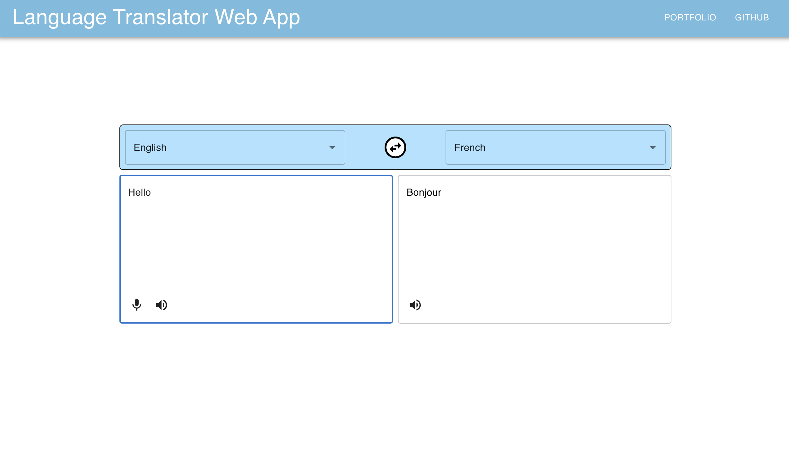

<a name="readme-top"></a>

[](https://GitHub.com/Naereen/StrapDown.js/graphs/commit-activity)
[](https://www.python.org/)


<!-- TABLE OF CONTENTS -->
<details>
  <summary>Table of Contents</summary>
  <ol>
    <li>
      <a href="#about-the-project">About The Project</a>
      <ul>
        <li><a href="#built-with">Built With</a></li>
      </ul>
    </li>
    <li>
      <a href="#getting-started">Getting Started</a>
      <ul>
        <li><a href="#prerequisites">Prerequisites</a></li>
      </ul>
    </li>
    <li><<a href="#installation">Installation</a></li>
  </ol>
</details>


<!-- ABOUT THE PROJECT -->
## About The Project



This project is a web application for a language translator with translation, digital-to-audio conversion and audio-to-digital conversion capabilitites using both React and Django frameworks. You can check out my other projects in the links at the upper navigation!


<p align="right">(<a href="#readme-top">back to top</a>)</p>


### Built With

Languages:
* Python
* Javascript
* Shell Script
* YAML

Frameworks:
* React
* Django
* MaterialUI

Libraries:
* gTTS
* googletrans
* pocketsphinx
* playsound
* io


<p align="right">(<a href="#readme-top">back to top</a>)</p>


<!-- GETTING STARTED -->
## Getting Started

There are 2 ways to run this application: Either without Docker through shell commands in `./run.sh` or with a Docker which has restricted functionality since playsound and pocketsphinx require personal OS capabilities not simulated OS in order to do adc and dac conversion.

### Installation

#### WITHOUT DOCKER WITH MORE CAPABILITIES
1. Clone the repo
  ```sh
  git clone https://github.com/dnnysoftware/Language-Translator-Web-App.git
  ```
2. Give file execute permissions to run.sh
  ```sh
  chmod +x run.sh
  ```
3. Change the "proxy" parameter in package.json to "http://127.0.0.1:8000"
4. Run Program
  * In root directory run by typing in CLI
  ```sh
  ./run.sh
  ```

#### WITH DOCKER WITH LESS CAPABILITIES
1. Clone the repo
  ```sh
  git clone https://github.com/dnnysoftware/Language-Translator-Web-App.git
  ```
2. Change the "proxy" parameter in package.json to "http://backend:8000"
3. Run/Build Docker Image
  ```sh
  docker-compose -f docker-compose.yml up --build
  ```

<p align="right">(<a href="#readme-top">back to top</a>)</p>